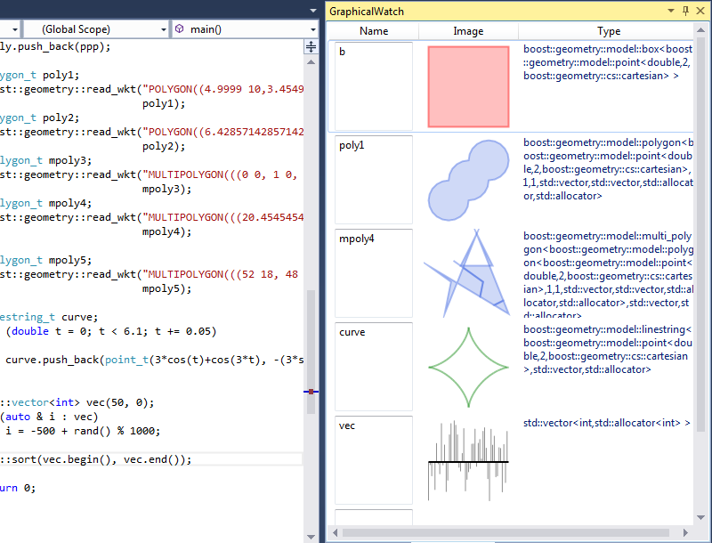
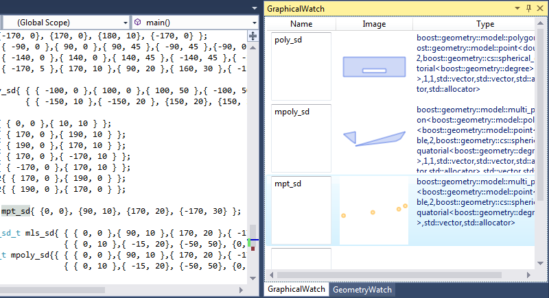

# GraphicalDebugging extension for Visual Studio 2015

This extension allows to display graphical representation of variables during debugging. Currently it supports Boost.Geometry and Boost.Polygon models, Boost.Variant and STL/Boost containers of values. It contains:

* Debugging visualizers for Boost.Array, Boost.Container, Boost.Geometry, Boost.Polygon and Boost.Variant
* GraphicalWatch tool window displaying graphical representation of variables, e.g. Boost.Geometry models or vectors of values
* GeometryWatch tool window displaying geometries some number of geometries in a common coordinate system, e.g. Boost.Geometry or Boost.Polygon polygons

To build you need e.g. Microsoft Visual Studio 2015 Community, .NET Framework 4.5.2 and Visual Studio 2015 SDK.

To install double-click the *.vsix file from bin/Debug or bin/Relase directory. The packages can also be found [here](https://github.com/awulkiew/graphical-debugging/tree/bin).

To use:

* place a breakpoint somewhere in the code
* start debugging
* after a breakpoint hit enable the tool window from the menu View->Other Windows->GraphicalWatch or View->Other Windows->GeometryWatch
* add variable to the list

Feel free to report bugs, propose features and create pull requests. Any help is appreciated.

#### Debugging vizualizers

Supported:

* Boost.Array: array
* Boost.Container: vector, static_vector
* Boost.Geometry: point, point_xy, box, segment, referring_segment, polygon, multi_point, multi_linestring, multi_polygon, rtree, varray, turn_info, traversal_turn_info
* Boost.Polygon: point_data, interval_data, segment_data, rectangle_data, polygon_data, polygon_with_holes_data
* Boost.Variant: variant

#### GraphicalWatch

Watch window displaying graphical representations of variables in a list. Each variable is placed and visualized in a separate row.

Supported:

* Containers of elements convertible to double
  * STL: array, vector, deque, list
  * Boost.Array: array
  * Boost.Container: vector, static_vector
* 2D cartesian geometries
  * Boost.Geometry: point, point_xy, box, segment, referring_segment, polygon, multi_point, multi_linestring, multi_polygon
  * Boost.Polygon: point_data, segment_data, rectangle_data, polygon_data, polygon_with_holes_data
* Non-cartesian geometries (spherical_equatorial and geographic)
  * Boost.Geometry: point, box, segment, referring_segment, polygon, multi_point, multi_linestring, multi_polygon
* Variants of geometries
  * Boost.Variant

Geometries in spherical_equatorial and geographic coordinate systems are displayed in a convenient, compact way.

where

    polygon_sd_t poly_sd{{{-100, 0},{100, 0},{100, 50},{-100, 50},{-100, 0}},
                         {{-150, 10},{-150, 20},{150, 20},{150, 10},{-150, 10}}};
    multi_polygon_sd_t mpoly_sd{{{{0, 0},{90, 10},{170, 20},{-170, 30},{-150, 60}},
                                 {{0, 10},{-15, 20},{-50, 50},{0, 60}}}};
    multi_point_sd_t mpt_sd{{0, 0},{90, 10},{170, 20},{-170, 30}};

#### GeometryWatch

Watch window displaying graphical representation of variables in a single image. This allows to compare the variables easily.

Supported:

* 2D cartesian geometries
  * Boost.Geometry: point, point_xy, box, segment, referring_segment, polygon, multi_point, multi_linestring, multi_polygon
  * Boost.Polygon: point_data, segment_data, rectangle_data, polygon_data, polygon_with_holes_data
* Non-cartesian geometries (spherical_equatorial and geographic)
  * Boost.Geometry: point, box, segment, referring_segment, polygon, multi_point, multi_linestring, multi_polygon
* Variants of geometries
  * Boost.Variant

Geometries in spherical_equatorial and geographic coordinate systems are displayed in a way allowing to see what coordinates were used to define a geometry. Note that various libraries may require coordinates in a certain range. This extension tries to display any coordinates as good as possible.

where

    polygon_sd_t poly_sd{{{-100, 0},{100, 0},{100, 50},{-100, 50},{-100, 0}},
                         {{-150, 10},{-150, 20},{150, 20},{150, 10},{-150, 10}}};
    multi_polygon_sd_t mpoly_sd{{{{0, 0},{90, 10},{170, 20},{-170, 30},{-150, 60}},
                                 {{0, 10},{-15, 20},{-50, 50},{0, 60}}}};
    multi_point_sd_t mpt_sd{{0, 0},{90, 10},{170, 20},{-170, 30}};
