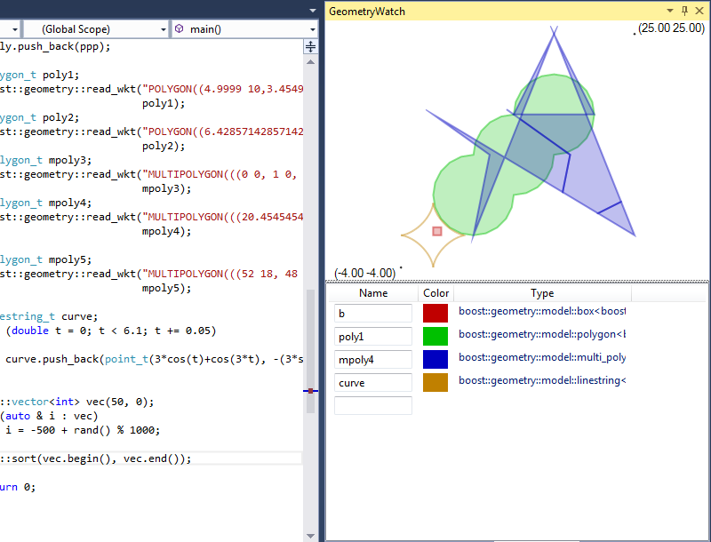
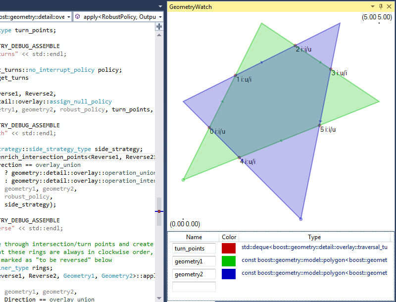

# GraphicalDebugging extension for Visual Studio 2015

This extension contains:

* Debugging vizualizers for Boost.Array, Boost.Geometry and Boost.Variant
* GraphicalWatch tool window allowing to view graphical representation of variables, e.g. Boost.Geometry models or vectors of values
* GeometryWatch tool window allowing to view Boost.Geometry 2D models drawn on a common plane

To build you need e.g. Microsoft Visual Studio 2015 Community, .NET Framework 4.5.2 and Visual Studio 2015 SDK.

To install double-click the *.vsix file from bin/Debug or bin/Relase directory, those files can also be found in bin branch of this repository.

To use:

* place a breakpoint somewhere in the code
* start debugging
* after a breakpoint hit enable the tool window from the menu View->Other Windows->GraphicalWatch or View->Other Windows->GeometryWatch
* add variable to the list

#### Debugging vizualizers

Supported:

* Boost.Array: array
* Boost.Container: vector, static_vector
* Boost.Geometry: point, point_xy, box, segment, referring_segment, polygon, multi_point, multi_linestring, multi_polygon, rtree, varray, turn_info, traversal_turn_info
* Boost.Polygon: point_data, interval_data, segment_data, rectangle_data, polygon_data, polygon_with_holes_data
* Boost.Variant: variant

#### GraphicalWatch

Watch window displaying graphical representations of variables in a list. Each variable is placed and visualizaed in a separate row.

Supported:

* Containers of elements convertible to double
  * STL: array, vector, deque, list
  * Boost.Array: array
  * Boost.Container: vector, static_vector
* 2D cartesian geometries
  * Boost.Geometry: point, point_xy, box, segment, referring_segment, polygon, multi_point, multi_linestring, multi_polygon
  * Boost.Polygon: point_data, segment_data, rectangle_data, polygon_data, polygon_with_holes_data
  * Boost.Variant: variant of geometries

#### GeometryWatch

Watch window displaying graphical representation of variables in a single image. This allows to compare the variables easily.

Supported:

* 2D cartesian geometries
  * Boost.Geometry: point, point_xy, box, segment, referring_segment, polygon, multi_point, multi_linestring, multi_polygon
  * Boost.Polygon: point_data, segment_data, rectangle_data, polygon_data, polygon_with_holes_data
  * Boost.Variant: variant of geometries

